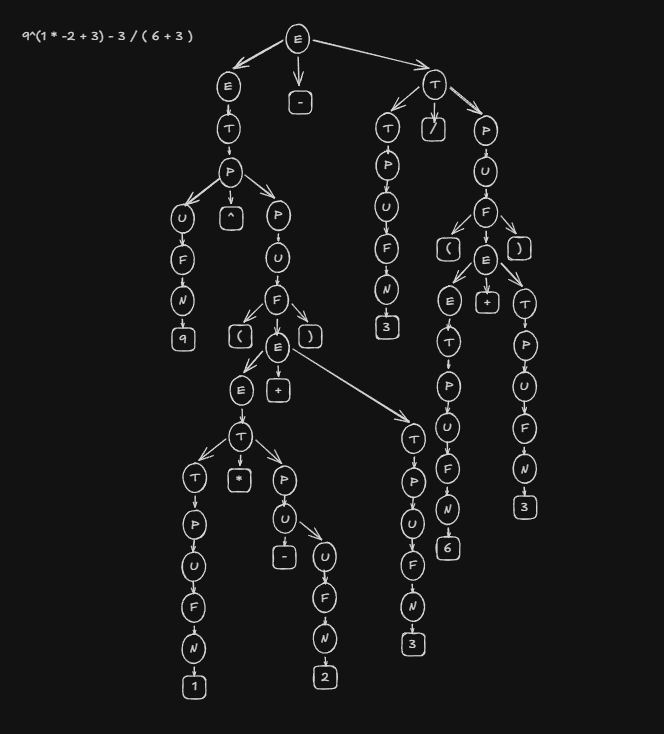

# EP — Parser de Expressões Matemáticas
## 1. Operações Reconhecidas

| Nome | Tipo | Exemplo |
|---|---|---|
| Número | Unária | 56 |
| Negativação | Unária | -1 |
| Parênteses | Unária | ( 3 ) |
| Potência | Binária | 6^2 |
| Soma | Binária | 5 + 3 |
| Diferença | Binária | 3 - 1 |
| Multiplicação | Binária | 6 * 1 |
| Divisão | Binária | 8 / 4 |

---

## 2. Gramática Sem Forma Normal (para Earley)

A gramática foi projetada respeitando:
- Precedência de operadores: parênteses > negativação > potência > multiplicação/divisão > soma/diferença
- Associatividade à esquerda para `+`, `-`, `*`, `/` e à direita para `^` (potência)
- Números com dígitos ilimitados (representados por `D+`)

**Símbolo inicial:** `E`

**Terminais:**
```
N  ::=  D+
D  ::=  '0' | '1' | '2' | '3' | '4' | '5' | '6' | '7' | '8' | '9'
```

**Produções:**
```
/* Expressão Aditiva (menor precedência) */
E    ->  E '+' T
E    ->  E '-' T
E    ->  T

/* Expressão Multiplicativa */
T    ->  T '*' P
T    ->  T '/' P
T    ->  P

/* Potenciação — associativa à direita */
P    ->  U '^' P
P    ->  U

/* Unários: negação e fator */
U    ->  '-' U
U    ->  F

/* Fator: parênteses ou número */
F    ->  '(' E ')'
F    ->  N

/* Número: sequência ilimitada de dígitos */
N  ->  D+
```

**Tabela de precedência (da mais alta à mais baixa):**

| Nível | Operador(es) | Associatividade |
|---|---|---|
| 1 (alta) | `( )`, número, `-u` | — |
| 2 | `^` | Direita |
| 3 | `*`, `/` | Esquerda |
| 4 (baixa) | `+`, `-` | Esquerda |

---

## 3. Gramática na Forma Normal de Chomsky (para CYK)

A Forma Normal de Chomsky (FNC) exige que toda produção seja da forma:
- `A -> B C` (dois não-terminais)
- `A -> a` (um único terminal)

Para converter a gramática original, foram aplicados os seguintes passos: eliminação de produções unitárias (E -> T -> P -> U -> F), introdução de não-terminais auxiliares para cada terminal que aparecia junto de não-terminais, e binarização de produções com mais de dois símbolos.

**Não-terminais auxiliares para terminais:**
```
T_MAIS   ->  '+'
T_MENOS  ->  '-'
T_VEZES  ->  '*'
T_DIV    ->  '/'
T_CHAPEU    ->  '^'
T_EPAR   ->  '('
T_DPAR   ->  ')'
T_0  ->  '0'    T_1  ->  '1'    T_2  ->  '2'    T_3  ->  '3'
T_4  ->  '4'    T_5  ->  '5'    T_6  ->  '6'    T_7  ->  '7'
T_8  ->  '8'    T_9  ->  '9'
```

**Produções em FNC:**
```
/* Número: sequência de dígitos */
NUM      ->  T_0 | T_1 | T_2 | T_3 | T_4 | T_5 | T_6 | T_7 | T_8 | T_9
NUM      ->  NUM DIGITO_NT
DIGITO_NT ->  T_0 | T_1 | T_2 | T_3 | T_4 | T_5 | T_6 | T_7 | T_8 | T_9

/* Parênteses: F -> '(' E ')'  =>  binarizado */
F        ->  NUM
F        ->  T_EPAR  PAREN_D
PAREN_D  ->  E  T_DPAR

/* Unário negativo: U -> '-' U */
U        ->  F
U        ->  T_MENOS  U

/* Potência (assoc. direita): P -> U '^' P */
P        ->  U
P        ->  U  POW_R
POW_R    ->  T_CHAPEU  P

/* Multiplicação e divisão (assoc. esq.) */
T        ->  P
T        ->  T  MUL_R
MUL_R    ->  T_VEZES  P
T        ->  T  DIV_R
DIV_R    ->  T_DIV    P

/* Soma e subtração (assoc. esq.) */
E        ->  T
E        ->  E  ADD_R
ADD_R    ->  T_MAIS   T
E        ->  E  SUB_R
SUB_R    ->  T_MENOS  T
```

---

## 4. Árvore de Derivação

**Expressão:** `9^(1 * -2 + 3) - 3 / ( 6 + 3 )`



**Interpretação passo a passo:**

1. A expressão raiz é `E -> E '-' T`, separando a subtração principal.
2. O lado esquerdo `E` reduz por `E -> T -> P -> U -> F -> N '9'`.
3. O nó `P` aplica a regra `P -> U '^' P`, onde o expoente `P` reduz a `U -> F -> '(' E ')'`.
4. Dentro dos parênteses, `E -> E '+' T` separa a soma.
5. Lado esquerdo da soma: `E -> T -> T '*' P`, onde `T` reduz a `P -> U -> F -> N '1'` e `P` reduz a `U -> '-' U -> F -> N '2'` (negativação).
6. Lado direito da soma: `T -> P -> U -> F -> N '3'`.
7. O lado direito da subtração principal: `T -> T '/' P`, com `T -> P -> U -> F -> N '3'`.
8. O `P` da divisão reduz a `U -> F -> '(' E ')'`, onde dentro `E -> E '+' T`, com `E -> T -> P -> U -> F -> N '6'` e `T -> P -> U -> F -> N '3'`.