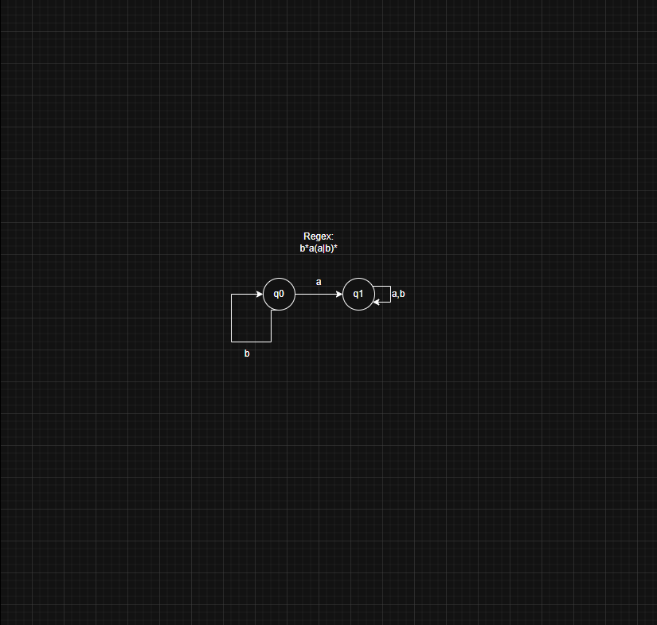
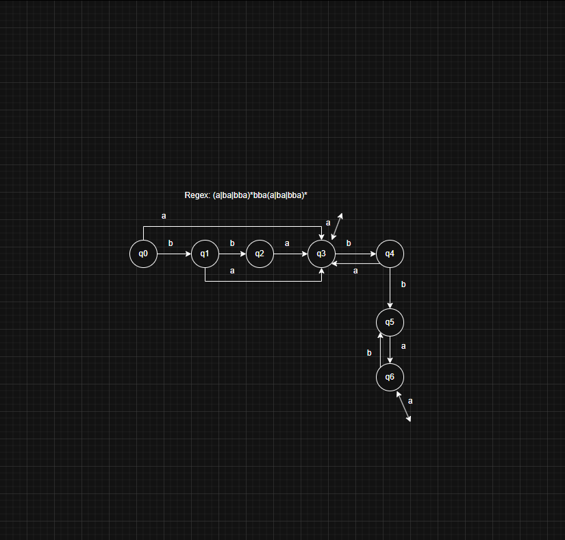
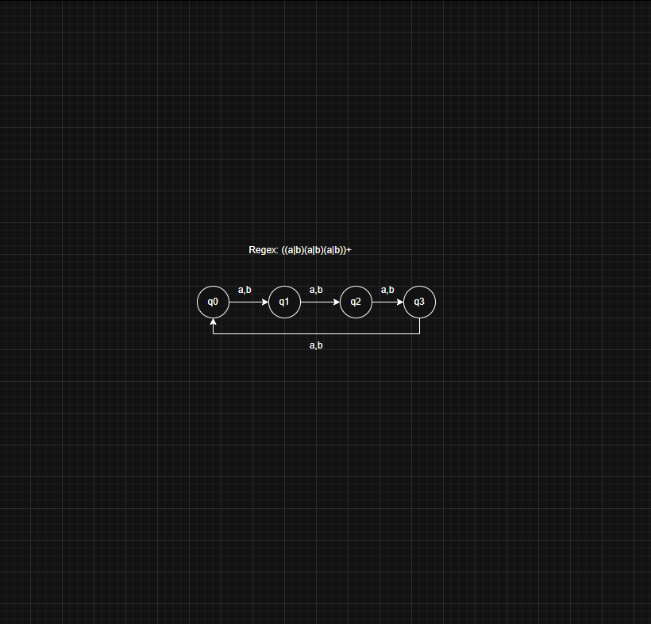
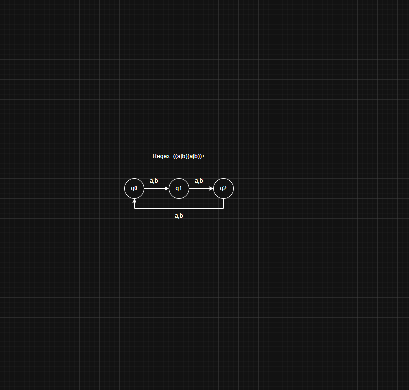
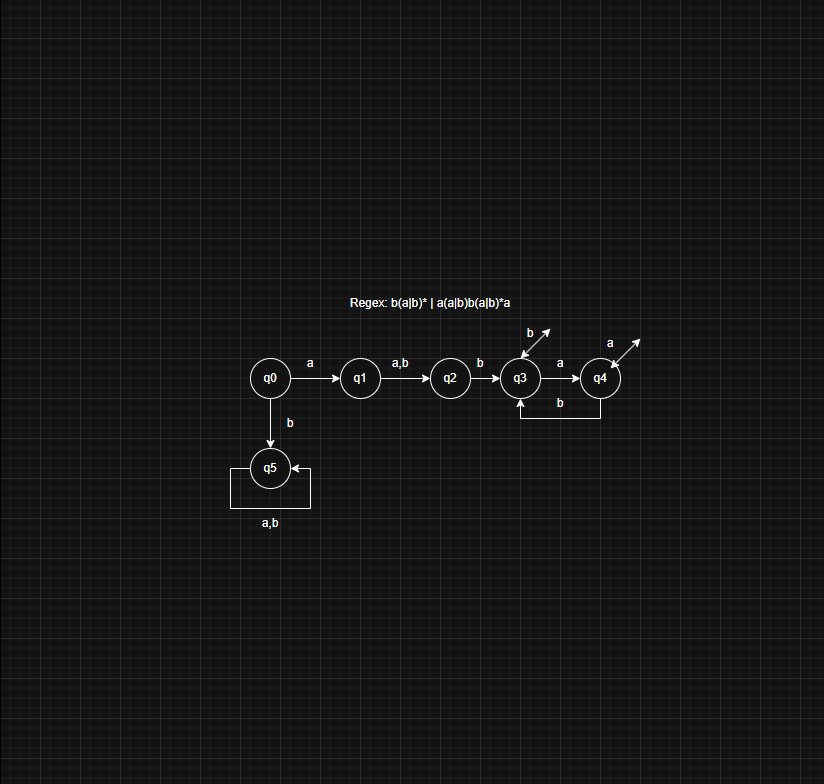
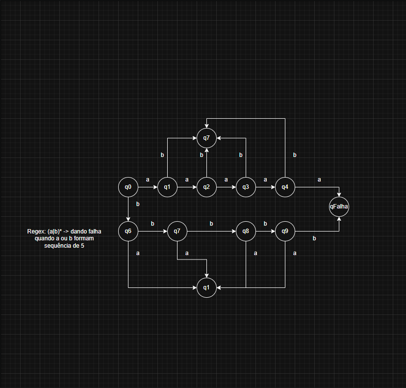
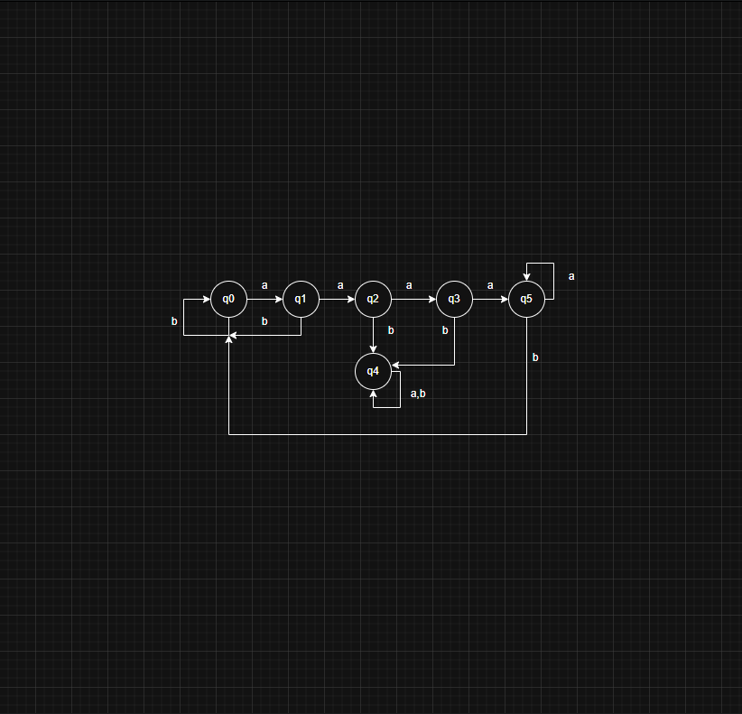
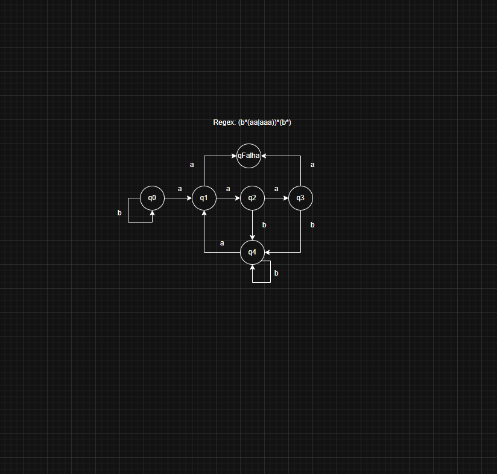
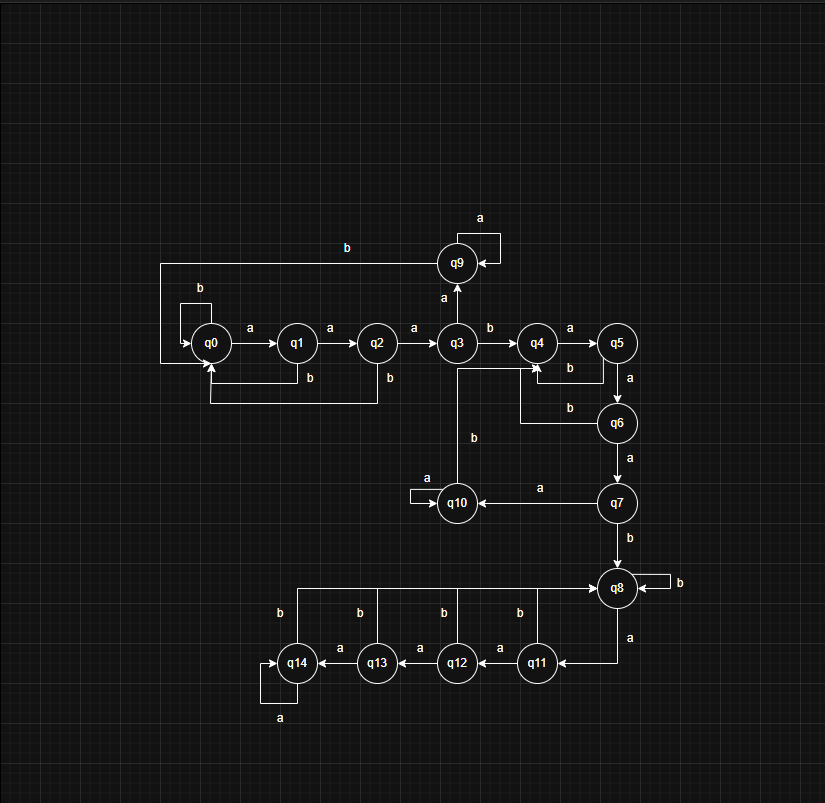

Para o alfabeto $\Sigma = \{a,b\}$, construa um Autômato que aceite as seguintes cadeias:

a)  L = { w | w tenha apenas um "a" }

Estados de aceitação: q1

b) L = { w |  w tenha pelo menos um "a" }

Estados de aceitação: q1

c) L = { w |  w tenha pelo menos um "a" e exatamente 2 "b"s (abb ou bb) como subcadeia }. Exemplo: bababababaaababababbabababa…

Estados de aceitação: q6

d) L = { w | |w| mod 3 = 0 } . Exemplo: aaa, bbbbbb, babaaabbb

Estados de aceitação: q3

e) L = { w | |w| é par }. Exemplo: aa, abbb, baba

Estados de aceitação: q2

f) L = { w | se o primeiro símbolo de w for ‘a’, o terceiro deve ser ‘b’ e o último deve ser ‘a’ novamente }

Estados de aceitação: q4, q5

g) L = { w | w contém nenhuma sequência maior do que 4 } Exemplo: aaaa, babababbb

Estados de aceitação: apenas qFalha não é um estado de aceitação

h) L = { w | w contém pelo menos uma sequência de "a"s com tamanho 2 ou 3 } Ex: bbabababaabbb, bababaaab, baabaaaa, aaaabaaa

Estados de aceitação: q2, q3 e q4

i) L = { w | w contém todas as sequências de "a"s com tamanho 2 ou 3. Não por ter apenas um “a” ou mais do que 4 “a”s. Não pode ter sequências concatenadas}

Estados de aceitação: q0, q2, q3 e q4

j) L = { w | w contém exatamente 2 sequências de "a"s de tamanho 3. Não pode ter sequências concatenadas formando 6 caracteres } Exemplo: abaaabaaabbba, aaababaaa. Ex erro: baabaaa, aaaabaaa

Estados de aceitação: q7, q8, q11, q12, q14
