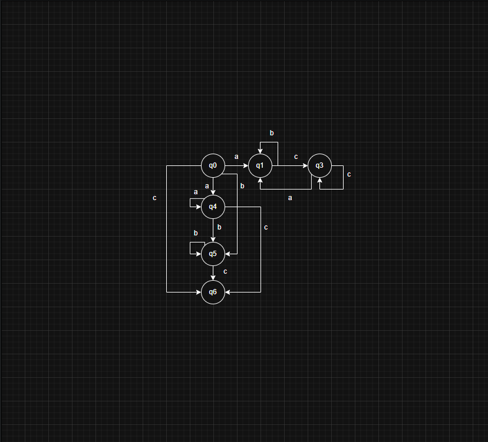
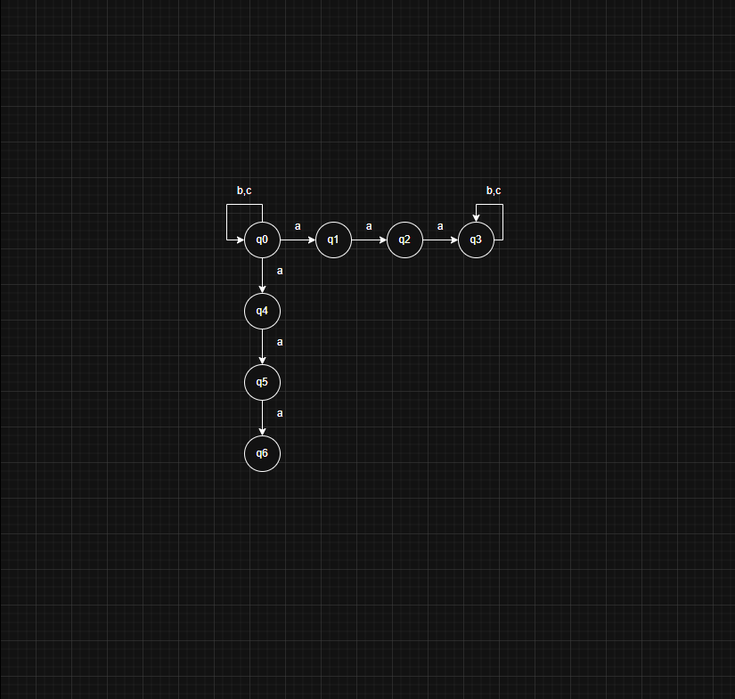
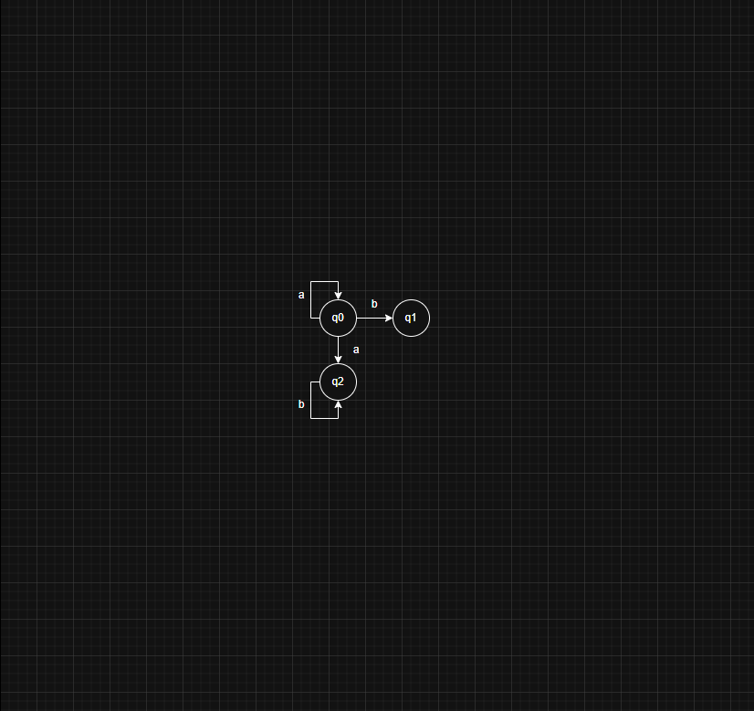
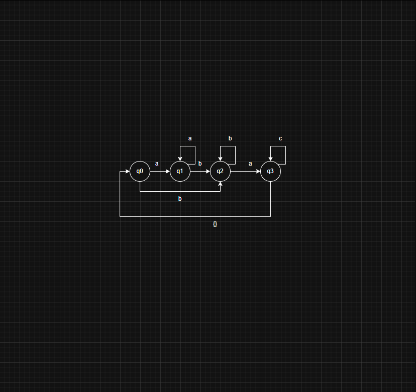
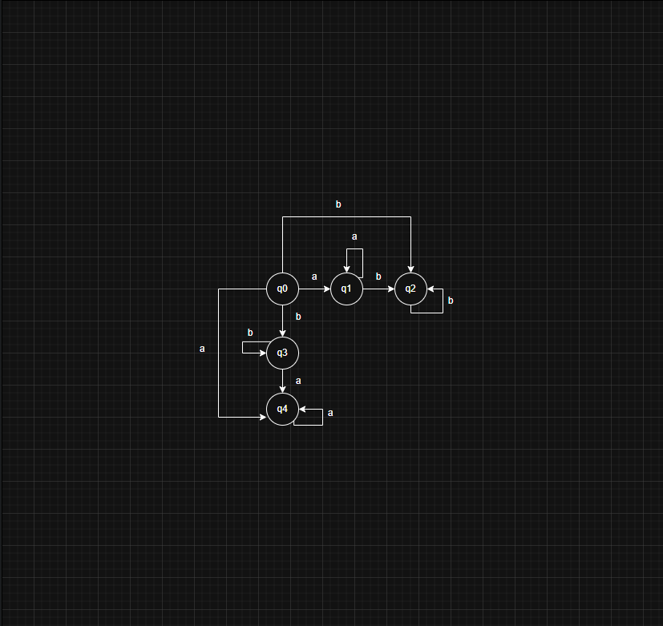
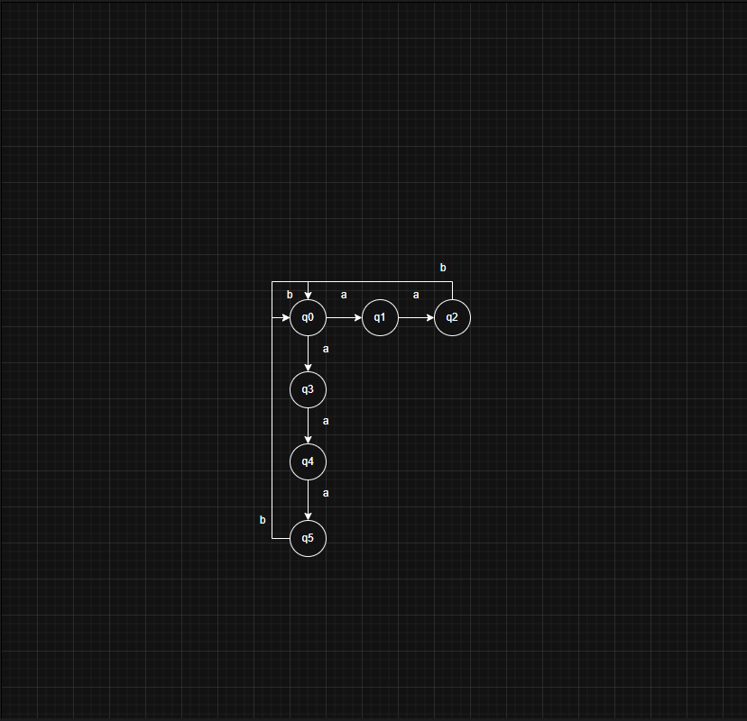
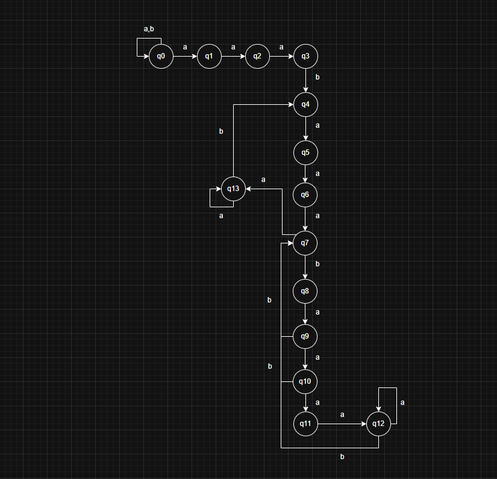

Dadas as linguagens, descreva um AFN ou AFN$\varepsilon$ que as reconheça, dado $\Sigma = \{a,b,c\}$:

a) (a b* c*) * | (a* b* c)

Estados de aceitação: q0, q1, q3 e q6

b) aaa(b | c)* | (b | c)* aaa

Estados de aceitação: q3 e q6

c) a* b | ab*

Estados de aceitação: q1 e q2

d) (a* b* (a|ac*) )*

Estados de aceitação: q0, q1 e q3

e) a* b* | b* a*

Estados de aceitação: todos

f) L = { w | cada sequência de "a"s tem tamanho 2 ou 3 }

Estados de aceitação: q0, q2, q4, q5

g) L = { w | há exatamente 2 sequências de "a"s de tamanho 3 }

Estados de aceitação: q7, q8, q9, q10, q12

