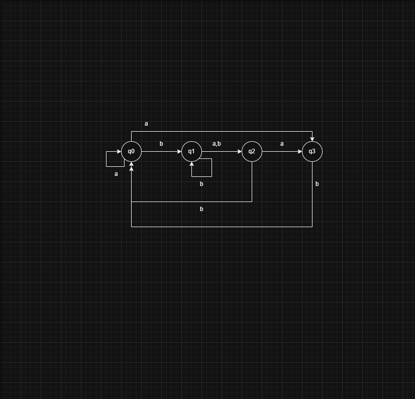
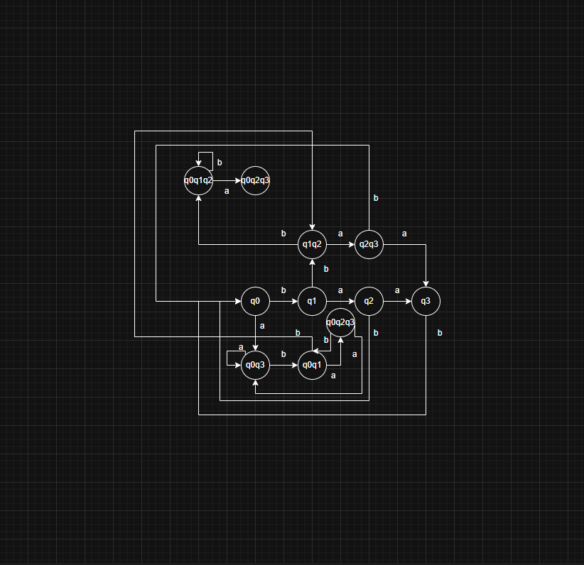
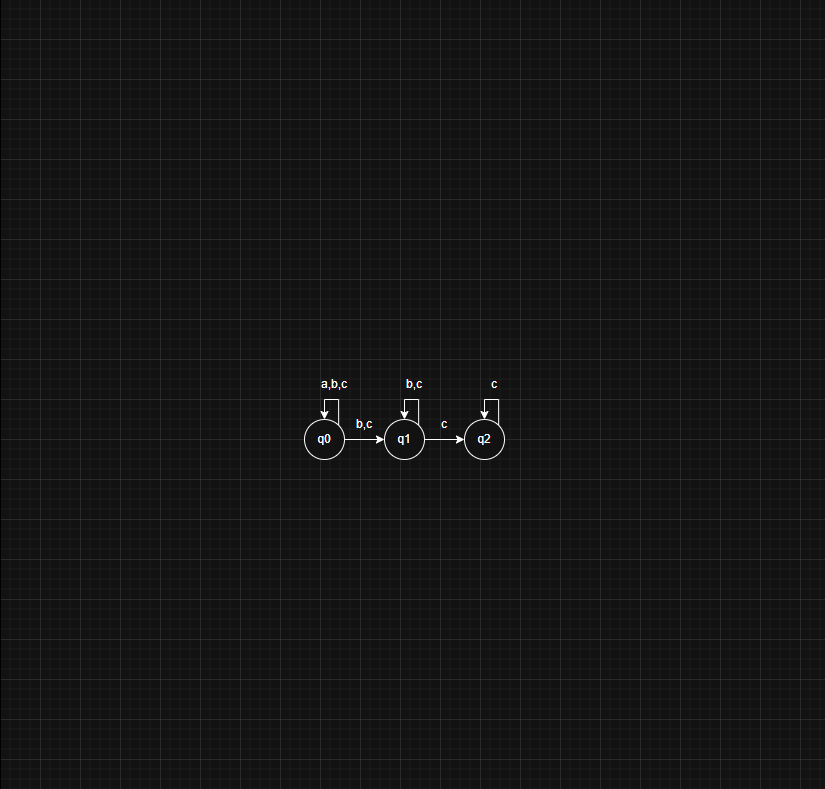
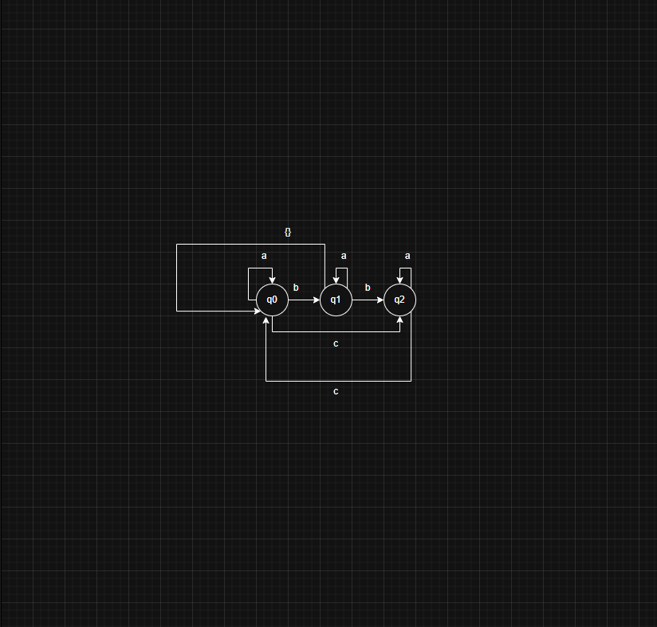

# AFN -> AFD

Dado o Autômato AFN $M = \{Q = \{q_0, q_1, q_2, q_3\}, \Sigma =\{a,b\},\delta,q_0,F=\{q_3\}\}$

| $\delta$ | a              | b             |
| -------- | -------------- | ------------- |
|$q_0$	   | $\{q_0,q_3\}$	| $\{q_1\}$     |
|$q_1$	   | $\{q_2\}$	    | $\{q_1,q_2\}$ |
|$q_2$	   | $\{q_3\}$	    | $\{q_0\}$     |
|$q_3$	   | -              | $\{q_0\}$     |

a) Desenha o autômato em sua forma gráfica

b) Converta o AFN M para um AFD M'

| $\delta$ | a              | b             |
| -------- | -------------- | ------------- |
| q0       | q0q3           | q1    
| q1       | q2             | q1q2
| q2       | q3             | q0
| q3       | -              | q0
| q0q3     | q0q3           | q0q1
| q1q2     | q2q3           | q0q1q2
| q2q3     | q3             | q0
| q0q1     | q0q2q3         | q1q2
| q0q2q3   | q0q3           | q0q1
| q0q1q2   | q0q2q3         | q0q1q2

Estados de aceitação: q3, q0q3, q2q3, q0q2q3

Dado $M = \{Q = \{q_0, q_1, q_2\}, \Sigma =\{a,b,c\},\delta,q_0,F=\{q_2\}\}$

| $\delta$ | a              | b             | c             |
| -------- | -------------- | ------------- | -----         |
|$q_0$	   | $\{q_0\}$	    | $\{q_0,q_1\}$ | $\{q_0,q_1\}$ |
|$q_1$	   | -	            | $\{q_1\}$     | $\{q_1,q_2\}$ |
|$q_2$	   | -              | -             | $\{q_2\}$     |

a) Desenhe o autômato M em sua forma gráfica

b) Converte o seguinte M para um AFD M'

| $\delta$ | a              | b             | c             |
| -------- | -------------- | ------------- | ------------- |
| q0       | q0             | q0q1          | q0q1          |
| q1       |                | q1            | q1q2          |
| q2       |                |               | q2            |
| q0q1     | q0             | q0q1          | q0q1q2        |
| q1q2     |                | q1            | q1q2          |
| q0q1q2   | q0             | q0q1          | q0q1q2        |

Estados de aceitação: q0q1q2

# AFN$\varepsilon$  → AFN → AFD

Considere o seguinte AFN$\varepsilon$ $M = \{Q = \{q_0, q_1, q_2\}, \Sigma =\{a,b,c\},\delta,q_0,F=\{q_2\}\}$

| $\delta$ | a              | b             | c             | $\varepsilon$ |
| -------- | -------------- | ------------- | ------------- | ------------- |
|$q_0$	   | $\{q_0\}$	    | $\{q_1\}$     | -             | -             |
|$q_1$	   | -	            | -             | -             | $\{q_2\}$     |
|$q_2$	   | -              | -             | $\{q_2\}$     | $\{q_0\}$     |

a) Desenhe o autômato em sua forma gráfica

b) Calcule o $\varepsilon$-Fechamento para cada estado

| $\delta$ | $\varepsilon$-Fechamento | será estado final na AFN? |
| -------- | ------------------------ | ------------------------- |
| q0       |  {q0}                    | Não                       |                        
| q1       |  {q0, q1, q2}            | Sim                       | 
| q2       |  {q0, q2}                | Sim                       | 

c) Converta o AFN$\varepsilon$ em um AFN

Estados de aceitação: q1 e q2

| $\delta$ | a              | b                         | c              | 
| -------- | -------------- | ------------------------- | -------------- |
|$q_0$	   | $\{q_0\}$	    | $\{q_0, q_1, q_2\}$       | -              | 
|$q_1$	   | $\{q_0\}$      | $\{q_0, q_1, q_2\}$       | $\{q_0, q_2\}$ |      
|$q_2$	   | $\{q_0\}$      | $\{q_0, q_1, q_2\}$       | $\{q_0, q_2\}$ |      

d) Converta o AFN de (c) em um AFD

Estados de aceitação: q0q2 e q0q1q2 (q1 e q2 não são alcançáveis e por isso são desconsiderados na AFD final)

| $\delta$      | a                 | b                         | c                 | 
| ------------- | ----------------- | ------------------------- | ----------------- |
|$q_0$	        | $\{q_0\}$	        | $\{q_0q_1q_2\}$           | -                 | 
|$q_0q_1q_2$    | $\{q_0\}$         | $\{q_0q_1q_2\}$           | $\{q_0q_2\}$      |
|$q_0q_2$       | $\{q_0\}$         | $\{q_0q_1q_2\}$           | $\{q_0q_2\}$      |

e) Qual linguagem este autômato reconhece?

(a* b+ (c|b)*)+

Considere o seguinte AFN$\varepsilon$

$M = \{Q = \{q_0, q_1, q_2\}, \Sigma =\{a,b,c\},\delta,q_0,F=\{q_2\}\}$

| $\delta$ | a        | b        | c        | $\varepsilon$  |
|----------|----------|----------|----------|--------------- |
| $q_0$    | $\{q_0\}$| $\{q_1\}$| $\{q_2\}$| -              |
| $q_1$    | $\{q_1\}$| $\{q_2\}$| -        | $\{q_0\}$      |
| $q_2$    | $\{q_2\}$| -        | $\{q_0\}$| -              |

b) Calcule o $\varepsilon$-Fechamento para cada estado

| $\delta$ | $\varepsilon$-Fechamento | será estado final na AFN? |
| -------- | ------------------------ | ------------------------- |
| q0       |  {q0}                    | Não
| q1       |  {q0, q1}                | Não
| q2       |  {q2}                    | Sim

c) Converta o AFN$\varepsilon$ em um AFN

Estados de aceitação: q2

| $\delta$ | a             | b                   | c         |
| ---------| ------------- | ------------------- | --------- |
| $q_0$    | $\{q_0\}$     | $\{q_0, q_1\}$      | $\{q_2\}$ |
| $q_1$    | $\{q_0, q_1\}$| $\{q_0, q_1, q_2\}$ | $\{q_2\}$ |
| $q_2$    | $\{q_2\}$     | -                   | $\{q_0\}$ |

d) Converta o AFN de (c) em um AFD

Estados de aceitação: q2, q0q2 e q0q1q2

| $\delta$        | a                 | b                         | c                 | 
| -------------   | ----------------- | ------------------------- | ----------------- |
| $q_0$           | $\{q_0\}$         | $\{q_0q_1\}$              | $\{q_2\}$         |
| $q_2$           | $\{q_2\}$         | -                         | $\{q_0\}$         |
| $q_0q_1$        | $\{q_0q_1\}$      | $\{q_0q_1q_2\}$           | $\{q_2\}$         |
| $q_0q_1q_2$     | $\{q_0q_1q_2\}$  | $\{q_0q_1q_2\}$            | $\{q_0q_2\}$      |
| $q_0q_2$        | $\{q_0q_2\}$      | $\{q_0q_1\}$              | $\{q_0q_2\}$      |

e) Qual linguagem este autômato reconhece?

a* (bca* | bb ( (a|b)* | c*(a|c)* ) | ca*)
